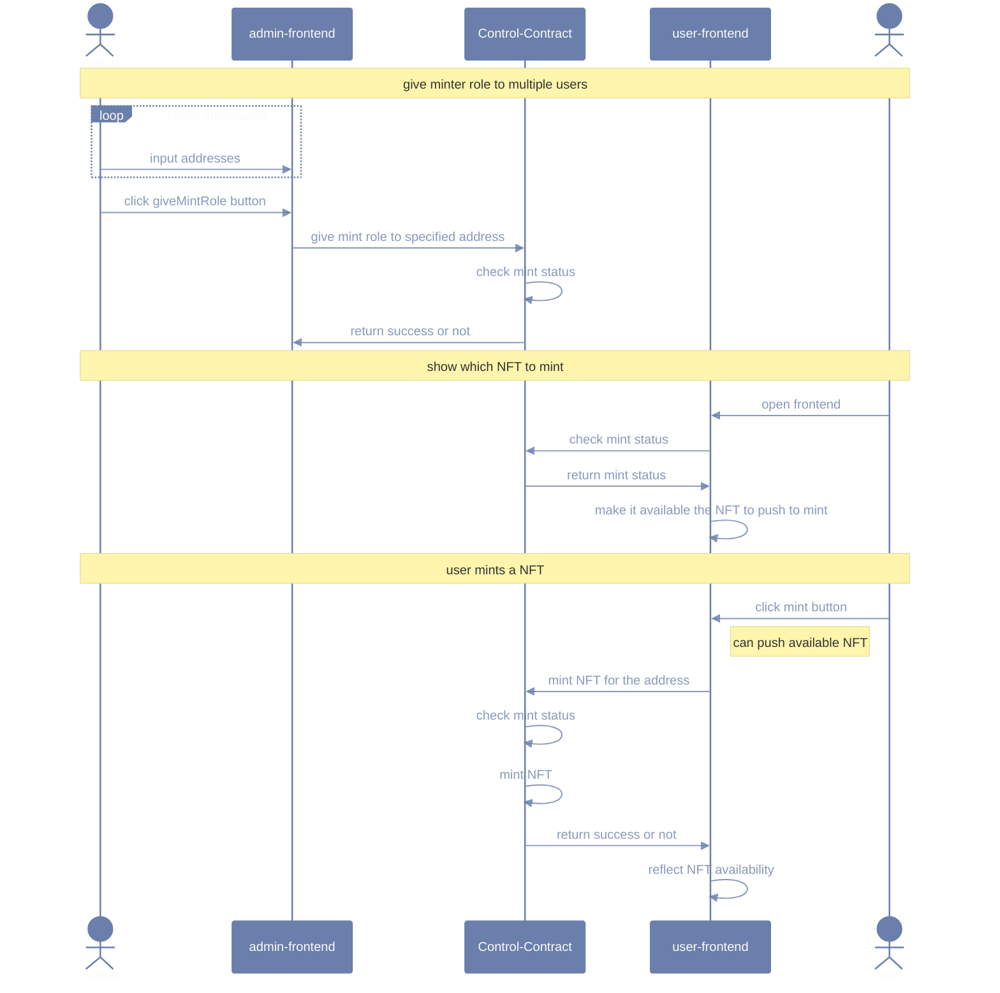
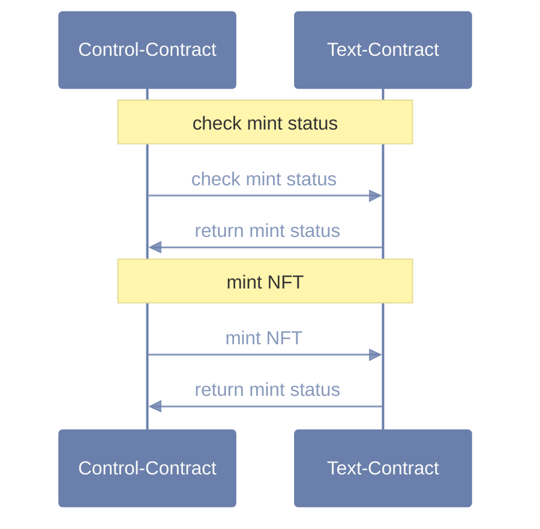
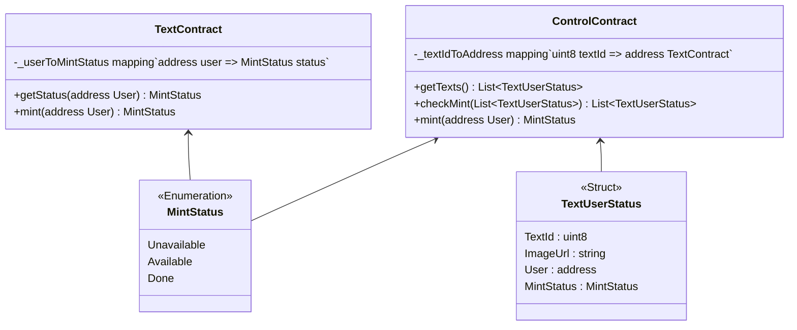

```mermaid
%%{init:{'theme':'base','themeVariables':{'primaryColor':'#6A7FAB','primaryTextColor':'#FAFBF9','primaryBorderColor':'#6A7FAB','lineColor':'#6A7FABCC','textColor':'#6A7FABCC','fontSize':'20px'}}}%%
sequenceDiagram
    actor A as Admin
    participant AF as admin-frontend
    participant CC as Control-Contract
    participant UF as user-frontend
    actor U as User
    Note over A,U: give minter role to multiple users
    loop store addresses
        A->>AF: input addresses
    end
    A->>AF: click giveMintRole button
    AF->>CC: give mint role to specified address
    CC->>CC: check mint status
    CC->>AF: return success or not
    Note over A,U: show which NFT to mint
    U->>UF: open frontend
    UF->>CC: check mint status
    CC->>UF: return mint status
    UF->>UF: make it available the NFT to push to mint
    Note over A,U: user mints a NFT
    U->>UF: click mint button
    Note right of UF: can push available NFT
    UF->>CC: mint NFT for the address
    CC->>CC: check mint status
    CC->>CC: mint NFT
    CC->>UF: return success or not
    UF->>UF: reflect NFT availability
```

```mermaid
%%{init:{'theme':'base','themeVariables':{'primaryColor':'#6A7FAB','primaryTextColor':'#FAFBF9','primaryBorderColor':'#6A7FAB','lineColor':'#6A7FABCC','textColor':'#6A7FABCC','fontSize':'20px'}}}%%
sequenceDiagram
    participant CC as Control-Contract
    participant TC as Text-Contract
    Note over CC,TC: check mint status
    CC->>TC: check mint status
    TC->>CC: return mint status
    Note over CC,TC: mint NFT
    CC->>TC: mint NFT
    TC->>CC: return mint status
```

## Class Diagram

```mermaid
classDiagram
    ControlContract <--MintStatus
    ControlContract <--TextUserStatus
    TextContract <-- MintStatus

    class ControlContract {
        -_textIdToAddress mapping`uint8 textId => address TextContract`
        +getTexts() List~TextUserStatus~
        +checkMint(List~TextUserStatus~) List~TextUserStatus~
        +mint(address User) MintStatus
    }

    class TextContract {
        -_userToMintStatus mapping`address user => MintStatus status`
        +getStatus(address User) MintStatus
        +mint(address User) MintStatus
    }

    class MintStatus {
        <<Enumeration>>
        Unavailable
        Available
        Done
    }

    class TextUserStatus {
        <<Struct>>
        TextId : uint8
        ImageUrl : string
        User : address
        MintStatus : MintStatus
    }
```