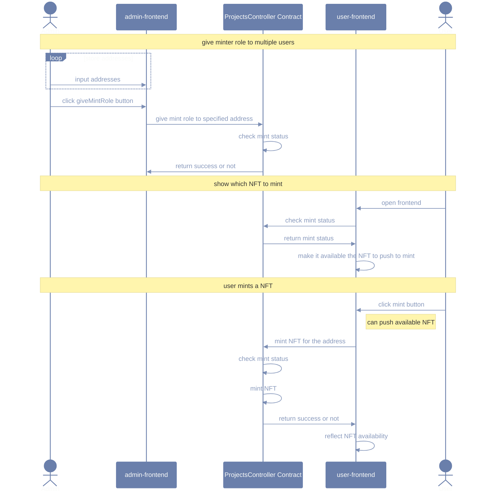
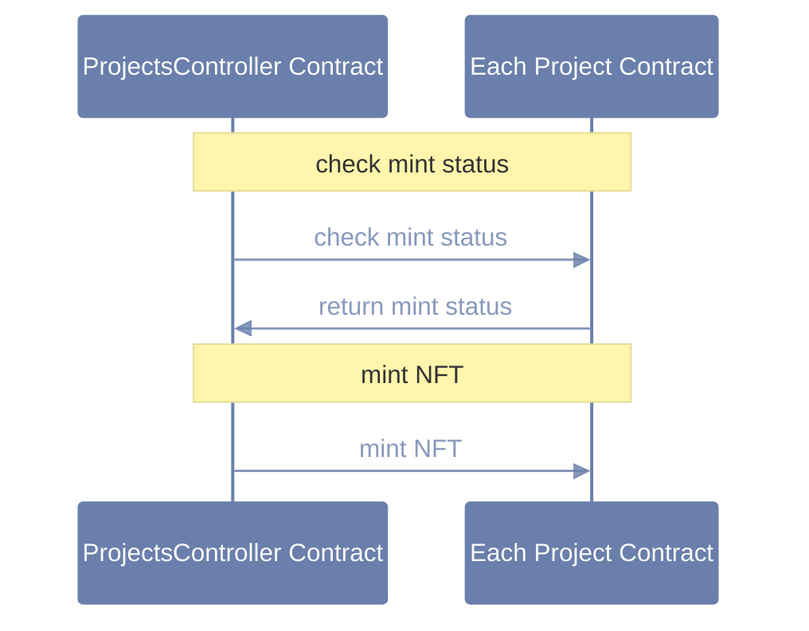
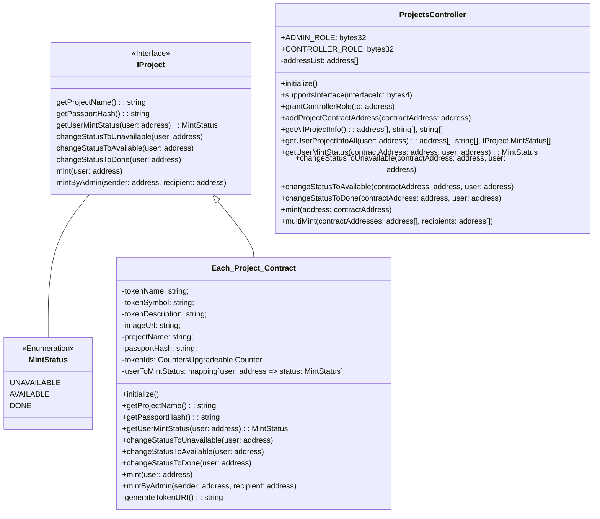

## Sequence Diagram

---

```mermaid
%%{init:{'theme':'base','themeVariables':{'primaryColor':'#6A7FAB','primaryTextColor':'#FAFBF9','primaryBorderColor':'#6A7FAB','lineColor':'#6A7FABCC','textColor':'#6A7FABCC','fontSize':'20px'}}}%%
sequenceDiagram
    actor A as Admin
    participant AF as admin-frontend
    participant CC as ProjectsController Contract
    participant UF as user-frontend
    actor U as User
    Note over A,U: give minter role to multiple users
    loop store addresses
        A->>AF: input addresses
    end
    A->>AF: click giveMintRole button
    AF->>CC: give mint role to specified address
    CC->>CC: check mint status
    CC->>AF: return success or not
    Note over A,U: show which NFT to mint
    U->>UF: open frontend
    UF->>CC: check mint status
    CC->>UF: return mint status
    UF->>UF: make it available the NFT to push to mint
    Note over A,U: user mints a NFT
    U->>UF: click mint button
    Note right of UF: can push available NFT
    UF->>CC: mint NFT for the address
    CC->>CC: check mint status
    CC->>CC: mint NFT
    CC->>UF: return success or not
    UF->>UF: reflect NFT availability
```

```mermaid
%%{init:{'theme':'base','themeVariables':{'primaryColor':'#6A7FAB','primaryTextColor':'#FAFBF9','primaryBorderColor':'#6A7FAB','lineColor':'#6A7FABCC','textColor':'#6A7FABCC','fontSize':'20px'}}}%%
sequenceDiagram
    participant CC as ProjectsController Contract
    participant TC as Each Project Contract
    Note over CC,TC: check mint status
    CC->>TC: check mint status
    TC->>CC: return mint status
    Note over CC,TC: mint NFT
    CC->>TC: mint NFT
```

## Class Diagram

---

```mermaid
classDiagram
    ProjectsController
    IProject -- MintStatus
    IProject <|-- Each_Project_Contract

    class ProjectsController {
        +ADMIN_ROLE: bytes32
        +CONTROLLER_ROLE: bytes32
        -addressList: address[]
        +initialize()
        +supportsInterface(interfaceId: bytes4)
        +grantControllerRole(to: address)
        +addProjectContractAddress(contractAddress: address)
        +getAllProjectInfo(): address[], string[], string[]
        +getUserProjectInfoAll(user: address): address[], string[], IProject.MintStatus[]
        +getUserMintStatus(contractAddress: address, user: address): MintStatus
        +changeStatusToUnavailable(contractAddress: address, user: address)
        +changeStatusToAvailable(contractAddress: address, user: address)
        +changeStatusToDone(contractAddress: address, user: address)
        +mint(address: contractAddress)
        +multiMint(contractAddresses: address[], recipients: address[])
    }

    class IProject {
        <<Interface>>
        getProjectName(): string
        getPassportHash(): string
        getUserMintStatus(user: address): MintStatus
        changeStatusToUnavailable(user: address)
        changeStatusToAvailable(user: address)
        changeStatusToDone(user: address)
        mint(user: address)
        mintByAdmin(sender: address, recipient: address)
    }

    class MintStatus {
        <<Enumeration>>
        UNAVAILABLE
        AVAILABLE
        DONE
    }

    class Each_Project_Contract {
        -tokenName: string;
        -tokenSymbol: string;
        -tokenDescription: string;
        -imageUrl: string;
        -projectName: string;
        -passportHash: string;
        -tokenIds: CountersUpgradeable.Counter
        -userToMintStatus: mapping`user: address => status: MintStatus`
        +initialize()
        +getProjectName(): string
        +getPassportHash(): string
        +getUserMintStatus(user: address): MintStatus
        +changeStatusToUnavailable(user: address)
        +changeStatusToAvailable(user: address)
        +changeStatusToDone(user: address)
        +mint(user: address)
        +mintByAdmin(sender: address, recipient: address)
        -generateTokenURI(): string
    }
```
