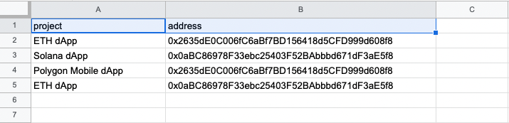
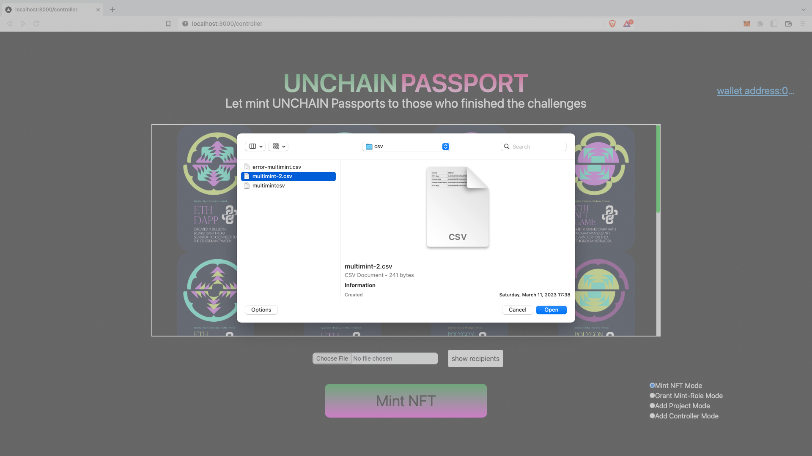

# ドキュメント

## はじめに

このドキュメントでは、アプリケーションの機能とその使用方法について説明します。

### 使用するイーサリアムネットワークについて

Polygon Mumbai ネットワークを例として用いています。

## 機能

アプリケーションには、3 つのページとそれぞれに以下の機能があります。

Home

- MetaMask ウォレットとの接続

Controller

- プロジェクトの追加
- 複数のユーザーへ NFT を発行
- `CONTROLLER` ロールの付与
- NFT の発行状況を`AVAILABLE`に変更

Minter

- NFT の取得状況を確認
- `AVAILABLE`の NFT をユーザー自身で発行

## 使用方法

### 1. 環境構築

アプリケーションのデプロイメントには、以下のものが必要です。インストール方法については、それぞれのリンク先を参照してください。

- [Node.js](https://hardhat.org/tutorial/setting-up-the-environment) >= 16.0
- [Yarn](https://chore-update--yarnpkg.netlify.app/ja/docs/install)
- [MetaMask](https://metamask.io/download/)

### 2. コントラクトの構築

#### 2-1. プロジェクトコントラクトの作成

---

`packages/contract/contracts/projects/`下には、既にリリース済みの学習コンテンツに対応するコントラクトが格納されています。

新たに学習コンテンツをリリースする際には、このディレクトリに対応するコントラクトを追加する必要があります。

以下の項目に従って、コントラクトを作成します。

- ファイル名・コントラクト名にはプロジェクト名を使用し、単語の区切りはアンダーバーとすること
- `IProject.sol`を継承すること
- トークンのメタデータをコントラクト内で定義すること

メタデータは、コントラクトの`initialize`関数内で定義されます。

`_projectName`と`_passportHash`の値を、設定してください。

（例）

```javascript
function initialize() public initializer {
  // Setup token
  _tokenName = 'UNCHAIN Passport';
  _tokenSymbol = 'CHAIPASS';
  _tokenDescription = 'Immutable and permanent proof of your UNCHAIN project completion.';
  // === TODO: 以下の2つの変数をプロジェクトに応じて設定する ===
  _projectName = 'ETH dApp';
  _passportHash = 'QmXk3kdRvV6TV9yZvtZPgKHoYmywnURy3Qhs8Bjo5szg1J';
  // ===

  __ERC721_init(_tokenName, _tokenSymbol);
}
```

#### 2-2. 単体テストを追加する

---

`contract/test/projects/`下に、2-1.で作成したコントラクトのテストスクリプトを追加します。テスト内容は、他のプロジェクトのテストを参考にしてください。

ファイル名は、通し番号として先頭にメタデータの`project_id`をつけます。

テストスクリプトを作成したら、テストを実行します。

```bash
npx hardhat test test/projects/<テストスクリプト名>
```

(実行例)

```bash
$ npx hardhat test test/projects/101.ETH_dApp.test.ts


  ETH_dApp
    getProjectName
      ✔ return project name (1459ms)
    getPassportHash
      ✔ return passportHash
    getUserMintStatus
      ✔ return default status 'UNAVAILABLE' of the learner
    changeStatusToUnavailable
      ✔ change learner's mint status to UNAVAILABLE
    changeStatusToAvailable
      ✔ change learner's mint status to AVAILABLE
    changeStatusToDone
      ✔ change learner's mint status to DONE
    mint
      when learner's mint status is AVAILABLE
        ✔ emit a NewTokenMinted event (43ms)
      when learner's mint status is UNAVAILABLE
        ✔ reverts
      when learner's mint status is DONE
        ✔ reverts
    mintByAdmin
      ✔ emit a NewTokenMinted event
    tokenURI
      ✔ should get a token URI (41ms)


  11 passing (2s)
```

全てのテストを通過したことが確認できたら、`test/0.integrated.test.ts`ファイルに`require`文を追加してください。

#### 2-3. デプロイスクリプトの作成

`contract/scripts/projects`ディレクトに、作成したコントラクトのデプロイスクリプトを追加します。スクリプトの内容は、他のプロジェクトを参考にしてください。

#### 2-4. .env ファイルの作成

---

⚠️ アカウントの秘密鍵を設定するため、.env ファイルは他者と共有したり、外部へ公開したりしないでください。

まずは、 `packages/contract`ディレクトリ内にある `.env.example` ファイルを複製して、`.env` ファイルを作成します。

(`.env`ファイル)

```bash
ETHERSCAN_API_KEY=ABC123ABC123ABC123ABC123ABC123ABC1
API_URL=<YOUR_API_URL>
PRIVATE_KEY=<YOUR_PRIVATE_KEY>
```

次に、`API_URL` を設定します。

Alchemy にログインし、Dashboard 上の 「 ＋ CREATE APP 」 をクリックします。

・NAME : 任意の値

・DESCRIPTION : 任意の値

・CHAIN ： `Polygon`

・NETWORK : `Polygon Mumbai`

を設定し、「 **CREATE APP** 」をクリックします。


ダッシュボードに、作成した内容が追加されるので、「 **VIEW KEY** 」をクリックします。


`HTTPS`をクリップボードにコピーします。


コピーした URL で、.env ファイルの `API_URL` の値を上書きします。

最後に `PRIVATE_KEY` を設定します。MetaMask を開き、画像右上・赤枠のメニューをクリックします。


「 **Account details** 」 > 「 **Export private key** 」と進み、パスワードを入力して Private Key をコピーします。

コピーした Private Key で、.env ファイルの `PRIVATE_KEY` の値を上書きします。

#### 2-5. MetaMask ネットワークの設定

---

「 **Add network** 」 > 「 **Add a network manually** 」と進み、以下の画像のようにネットワークの設定を行います。

`New RPC URL`の部分には、先ほど Alchemy から取得した URL（.env ファイルの`API_URL`）を設定してください。


「 **Save** 」ボタンを押し、`Mumbai`ネットワークが選択されていることを確認しましょう。


Mumbai ネットワーク用のトークンは、以下の URL から取得することができます（2 Mumbai MATIC/day）。

https://mumbaifaucet.com/

#### 2-6. コントラクトのデプロイ

---

コントラクトを**Mumbai**ネットワークへデプロイします。

##### 1. ProjectController コントラクトのデプロイ

以下のコマンドを実行してください。

```bash
npx hardhat run --network mumbai scripts/deployController.ts
```

(実行例)

```bash
$ npx hardhat run --network mumbai scripts/deployController.ts

deployController.ts
ProjectController upgraded to: 0x5FbDB2315678afecb367f032d93F642f64180aa3
```

`ProjectController upgraded to:`以降に出力されたアドレスは、3-1. .env.local ファイルの作成」で使用します。

##### 2. 各プロジェクトコントラクトのデプロイ

以下のコマンドを実行してください

```bash
npx hardhat run --network mumbai scripts/projects/<デプロイスクリプト名>
```

(実行例)

```bash
$ npx hardhat run --network mumbai scripts/projects/101.ETH_dApp.test.ts

ETH_dApp upgraded to: 0xebaD4Ce099cd1BFffE3C7aF59ACc4E03D4626afD
```

`<コントラクト名> upgraded to:`以降に出力されたアドレスは、「4. 操作 - プロジェクトの追加」で使用します。

### 3. クライアントアプリケーションの起動

#### 3-1. .env.local ファイルの作成

---

`packages/client`ディレクトリ下に存在する `.env.example` ファイルを複製して、 `.env.local` ファイルを作成します。

「2-6-1. ProjectController コントラクトのデプロイ」で出力されたコントラクトのアドレスを、`NEXT_PUBLIC_CONTRACT_ADDRESS`の値に設定します。

（例）

```bash
NEXT_PUBLIC_CONTRACT_ADDRESS = "0x5FbDB2315678afecb367f032d93F642f64180aa3"
```

#### 3-2. 起動

---

クライアントの開発サーバーを起動します。

```bash
yarn client:dev
```

### 4. 操作

#### MetaMask ウォレットとの接続

---

アプリケーションに MetaMask ウォレットを接続する操作です。

接続できるのは、`ADMIN`ロールまたは`CONTROLLER`ロールを持つユーザーのみとなります。

https://localhost:3000 にアクセスをします。


「 **Connect Wallet** 」ボタンを押して、接続したいアドレスを 1 つ選択して接続をします。


接続が完了したら、自動で https://localhost:3000/controller へリダイレクトします。

#### プロジェクトの追加

---

「2-6.2」でデプロイをした学習コンテンツのコントラクトアドレスを、**ProjectController**コントラクトに追加する操作です。

右下のラジオボタン「 **Add Project Mode** 」を選択します。


表示されたフォームに、追加したいプロジェクトのコントラクトアドレスを入力します。

「 **Add Project** 」ボタンを押すと、MetaMask へリダイレクョション（または通知）が発生します。トランザクションの内容に問題がなければ「 **Confirm** 」を選択します。


処理が完了したことを確認できたら、ページをリロードしてください。NFT 画像一覧に、追加したプロジェクトの NFT 画像が追加されていたら完了です。


#### 複数のユーザーへ NFT を発行

---

CSV ファイルをアップロードし、複数のアドレスに NFT を発行する操作です。

##### CSV ファイルの準備

- 項目は、 `project`と`address`の 2 項目にしてください
- `project`には、プロジェクト名（メタデータ一覧は[こちら](https://github.com/unchain-tech/UNCHAIN-projects/tree/main/public/metadata)を参照）を指定してください
- `address`には、NFT を受け取るアドレスを指定してください

（例）



右下のラジオボタン「 **Mint NFT Mode** 」を選択します。


「 **Choose File** 」ボタンを押し、CSV ファイルをアップロードします。



「 **Mint NFT** 」ボタンを押して、トランザクションの承認をします。

#### `CONTROLLER` ロールの付与

---

ユーザーに対し、`CONTROLLER`ロールを付与する操作です。これは、**`ADMIN`ロールを所有する（ProjectController をデプロイした）ユーザーのみが実行できる機能**になります。

右下のラジオボタン「 **Add Controller Mode** 」を選択します。


表示されたフォームに、`CONTROLLER`ロールを付与したいユーザーのアドレスを入力します。

「 **Add Controller** 」ボタンを押して、トランザクションの承認をします。

#### NFT 発行状況を`AVAILABLE`に変更

---

指定したアドレスの Mint ステータスを`AVAILABLE`にする操作です。

右下のラジオボタン「 **Grant Mint-Role Mode** 」を選択します。


表示されたフォームに対し、左から順に操作を行います。

- プロジェクト名の選択
- アドレスの入力
- 「 **Add Address** 」ボタンを押して入力した内容を追加

プロジェクト名とアドレスのペアを追加し終えたら「 **Grant Mint-Role** 」ボタンを押して、トランザクションの承認をします。

#### NFT の取得状況を確認する

---

各プロジェクトの NFT 取得状況を確認する操作です。MetaMask ウォレットを接続しているユーザーの NFT 取得状況が確認できます。

http://localhost:3000/minter にアクセスをします。

ProjectController コントラクトに追加しているプロジェクトの、NFT 画像一覧が表示されます。


取得状況は 3 種類で表現されます。

1. まだプロジェクトをクリアしていない：「赤で`not cleared`」
2. クリアして NFT の発行ができる
3. 既に NFT が発行されている：「緑で`already minted`」

#### `AVAILABLE`の NFT をユーザー自身で発行

---

http://localhost:3000/minter にアクセスをします。

NFT 画像をクリックし、トランザクションの承認をします。


処理が完了したことを確認できたら、ページをリロードしてください。


NFT が発行されると、ステータスは「 already minted 」に変わります。


